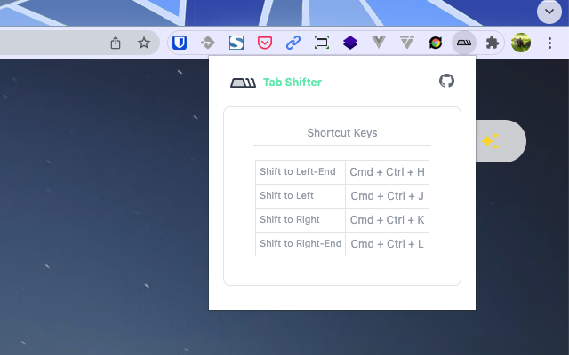

# Chrome Extension Tab Shifter

Article Here: https://tech.fusic.co.jp/posts/2022-03-15-chrome-webext-tab-shifter/

<p align="center">
<sub>Main</sub><br/>
<br/>
<sub>Popup</sub><br/>
<br/>
</p>

## Features

- Shift active tab to left / right
  - Left-end ： `Cmd + Ctrl + J`
  - Right-end ： `Cmd + Ctrl + K`
- Shift active tab to left-end / right-end
  - Left-end ： `Cmd + Ctrl + H`
  - Right-end ： `Cmd + Ctrl + L`

### Folders

- `src` - main source.
  - `contentScript` - scripts and components to be injected as `content_script`
  - `background` - scripts for background.
  - `components` - auto-imported Vue components that are shared in popup and options page.
  - `styles` - styles shared in popup and options page
  - `manifest.ts` - manifest for the extension.
- `extension` - extension package root.
  - `assets` - static assets.
  - `dist` - built files, also serve stub entry for Vite on development.
- `scripts` - development and bundling helper scripts.

### Development

```bash
pnpm dev
```

Then **load extension in browser with the `extension/` folder**.

For Firefox developers, you can run the following command instead:

```bash
pnpm start:firefox
```

`web-ext` auto reload the extension when `extension/` files changed.

> While Vite handles HMR automatically in the most of the case, [Extensions Reloader](https://chrome.google.com/webstore/detail/fimgfedafeadlieiabdeeaodndnlbhid) is still recommanded for cleaner hard reloading.

### Build

To build the extension, run

```bash
pnpm build
```

And then pack files under `extension`, you can upload `extension.crx` or `extension.xpi` to appropriate extension store.

<br>

## Credits

This uses template [antfu/vitesse-webext: ⚡️ WebExtension Vite Starter Template](https://github.com/antfu/vitesse-webext) 🙏 Huge thanks.
